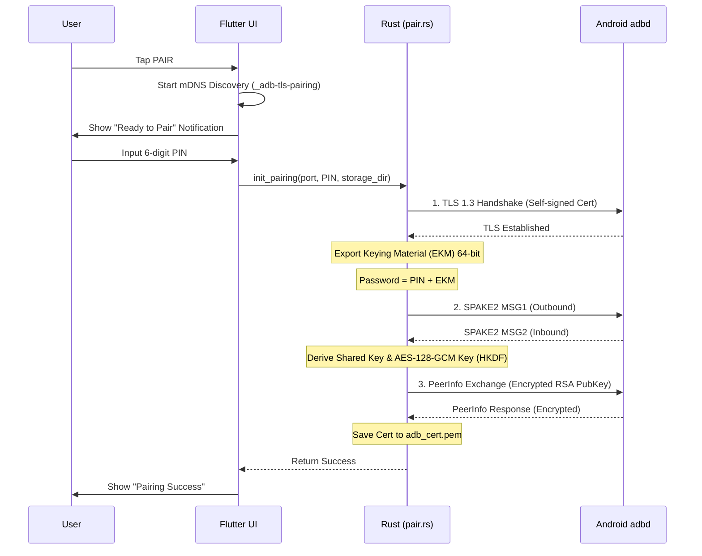
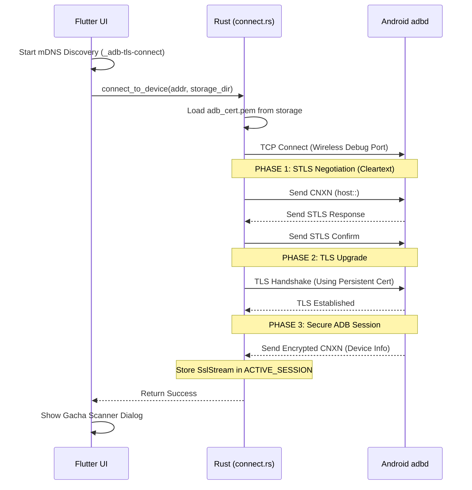

# Stellar Flow Diagrams

Dokumen ini menjelaskan alur teknis proses **Pairing** dan **Connection** antara aplikasi Stellar dan layanan Android Wireless Debugging.

## 1. Alur Proses Pairing (SPAKE2)

Proses ini dilakukan sekali untuk mendaftarkan sertifikat Stellar ke sistem Android.

## 2. Alur Proses Connection (ADB Secure)

Proses ini dilakukan setiap kali aplikasi ingin memulai sesi perintah ADB (seperti logcat).

## Keterangan Teknis

- **SPAKE2:** Digunakan untuk otentikasi berbasis password tanpa mengirimkan password asli melalui jaringan.
- **EKM:** Menjamin bahwa sesi SPAKE2 terikat secara kriptografis ke sesi TLS yang aktif.
- **STLS:** Protokol transisi milik ADB untuk meningkatkan koneksi dari TCP biasa ke TLS (Secure ADB).