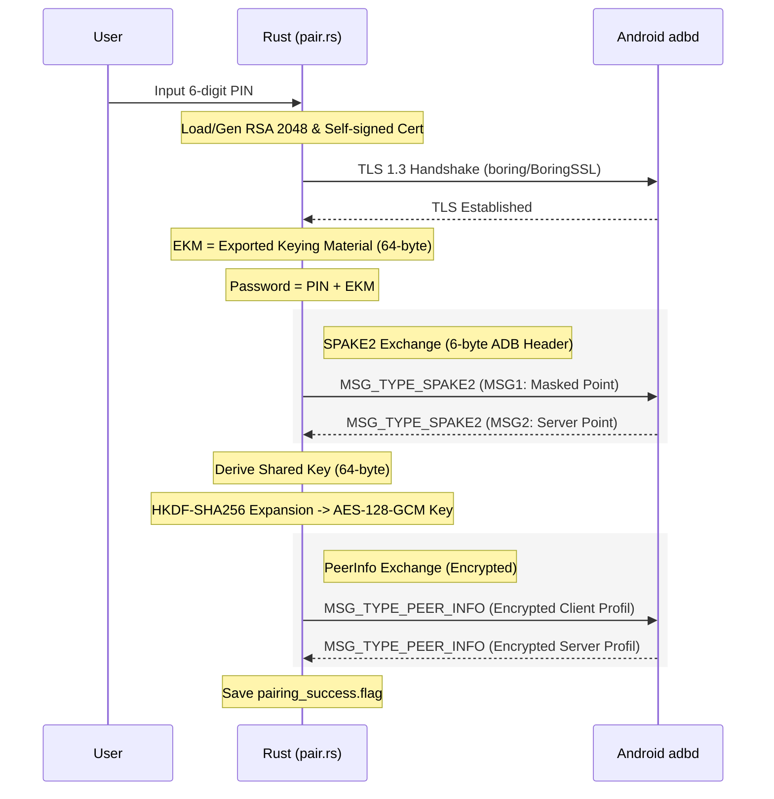
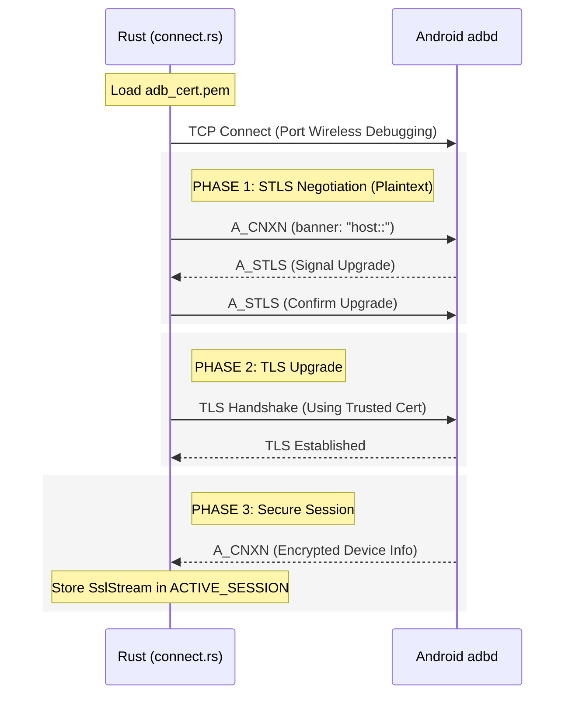

# Stellar Technical Flow Deep Dive

Dokumen ini menjelaskan secara rinci implementasi protokol **ADB Wireless Debugging** (Android 11+) yang digunakan oleh Stellar untuk melakukan pairing, koneksi aman, dan scanning gacha link.

---

## 1. Fase Pairing (SPAKE2 Handshake)

Fase ini bertujuan untuk mendaftarkan kunci publik RSA Stellar ke dalam daftar perangkat terpercaya Android melalui protokol PAKE (Password-Authenticated Key Exchange).

### Diagram Urutan Detail (Pairing)

### Rincian Kriptografi & Protokol
1.  **Struktur Header Pairing (6 byte):**
    Setiap pesan dalam fase pairing menggunakan header sederhana:
    - `[0]`: Version (0x01)
    - `[1]`: Type (0x00=SPAKE2, 0x01=PeerInfo)
    - `[2..5]`: Payload Length (Big-Endian i32)
2.  **Session Binding (EKM):**
    Menggunakan label `"adb-label\0"` melalui BoringSSL. EKM memastikan bahwa jika sesi TLS dibajak, proses SPAKE2 akan gagal karena password `PIN+EKM` tidak akan cocok.
3.  **AES-128-GCM:**
    Kunci AES diturunkan menggunakan HKDF-SHA256 dengan info `b"adb pairing_auth aes-128-gcm key"`. Initial Vector (IV) dimulai dari 12-byte nol.

---

## 2. Fase Connection (ADB Secure)

Setelah dipasangkan, Stellar membangun terowongan (tunnel) terenkripsi untuk mengirim perintah ADB.

### Diagram Urutan Detail (Connection)

### Struktur Paket ADB (24 byte Header)
Koneksi ini menggunakan format paket standar ADB:
- `command` (u32): A_CNXN, A_OPEN, A_WRTE, dll.
- `arg0`, `arg1` (u32): Tergantung perintah.
- `data_len` (u32): Panjang payload.
- `data_check` (u32): Checksum data.
- `magic` (u32): `command ^ 0xffffffff`.

---

## 3. Fase Scanning (Logcat Stream)

Stellar menggunakan sesi aktif untuk memantau log sistem secara real-time.

### Alur Kerja Perintah Shell
1.  **A_OPEN:** Stellar mengirim paket `A_OPEN` dengan payload perintah shell (misal: `shell:logcat -b all | grep gacha`).
2.  **A_OKAY:** `adbd` merespons dengan `A_OKAY`, menandakan stream telah dibuka.
3.  **A_WRTE (Stream Inbound):** `adbd` mengirimkan potongan log sistem melalui paket `A_WRTE`.
4.  **A_OKAY (Ack):** Stellar membalas dengan `A_OKAY` setiap kali menerima paket `A_WRTE` untuk menjaga aliran data (flow control).
5.  **Regex Matching:** Rust melakukan pemindaian pada string log untuk menemukan pola URL:
    - `https://(webstatic|hk4e-api|...).(mihoyo|hoyoverse).com/...`
    - Harus mengandung parameter `authkey`.
6.  **A_CLSE:** Begitu link ditemukan, Stellar mengirim paket `A_CLSE` untuk menutup stream logcat dan membebaskan sumber daya.

---

## Ringkasan Perintah ADB (Opcode)

| Perintah | Hex Code | Deskripsi |
| :--- | :--- | :--- |
| **A_CNXN** | `0x4e584e43` | Koneksi awal / Perkenalan |
| **A_STLS** | `0x534c5453` | Sinyal upgrade ke TLS |
| **A_OPEN** | `0x4e45504f` | Membuka stream layanan (shell, sync, dll) |
| **A_OKAY** | `0x59414b4f` | Konfirmasi paket / Ack |
| **A_WRTE** | `0x45545257` | Pengiriman data payload |
| **A_CLSE** | `0x45534c43` | Penutupan stream |