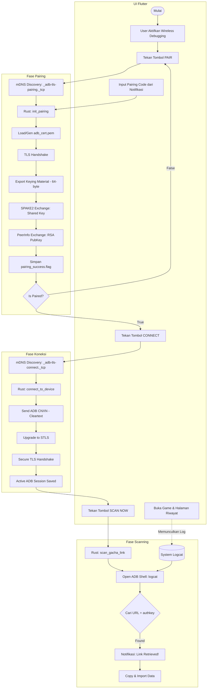

# Alur Kerja Stellar (Pairing -> Connect -> Scan)

Diagram ini menjelaskan bagaimana Stellar berkomunikasi dengan sistem Android menggunakan protokol ADB Wireless Debugging melalui jembatan Flutter & Rust.

## Detail Teknis

### 1. Pairing (Self-Pairing)
Stellar menggunakan teknik *self-pairing* di mana aplikasi bertindak sebagai klien ADB untuk dirinya sendiri.
- **mDNS:** Digunakan untuk menemukan port acak yang dibuka oleh sistem Android untuk layanan pairing (`_adb-tls-pairing._tcp`).
- **SPAKE2:** Protokol pertukaran kunci yang aman berdasarkan password (pairing code).
- **EKM:** Exported Keying Material sebesar 64-byte yang menggabungkan PIN untuk keamanan tambahan.
- **Certificates:** Stellar men-generate sertifikat RSA self-signed yang disimpan secara lokal (`adb_cert.pem`) untuk otentikasi di masa mendatang.

### 2. Connection
Setelah pairing sukses, Stellar tidak perlu lagi meminta kode pairing.
- **mDNS:** Menemukan port layanan koneksi (`_adb-tls-connect._tcp`).
- **STLS:** Upgrade koneksi TCP biasa ke TLS (Secure) sesuai spesifikasi ADB modern (Android 11+).
- **Session Persistence:** Sesi TLS disimpan dalam `ACTIVE_SESSION` di memori Rust untuk digunakan kembali saat scanning.

### 3. Scanning
Proses scanning dilakukan dengan membaca output dari perintah `logcat`.
- **Grep Filter:** Rust melakukan filtering secara real-time terhadap stream logcat untuk mencari pola URL gacha yang valid.
- **Authkey:** Link hanya dianggap valid jika mengandung parameter `authkey`, yang diperlukan untuk mengakses API riwayat gacha HoYoverse.
