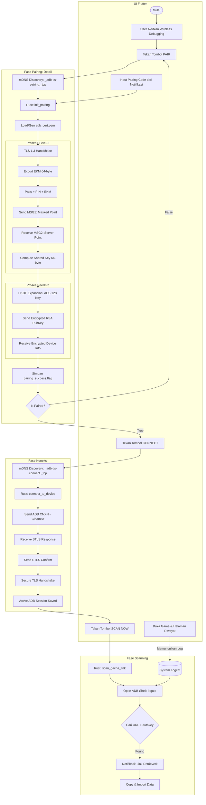

# Alur Kerja Stellar (Pairing -> Connect -> Scan)

Diagram ini menjelaskan bagaimana Stellar berkomunikasi dengan sistem Android menggunakan protokol ADB Wireless Debugging melalui jembatan Flutter & Rust.

## Detail Teknis

### 1. Pairing (Self-Pairing)
Stellar menggunakan teknik *self-pairing* di mana aplikasi bertindak sebagai klien ADB untuk dirinya sendiri.
- **mDNS:** Menemukan port pairing (`_adb-tls-pairing._tcp`).
- **TLS 1.3:** Enkripsi dasar untuk pertukaran kunci.
- **SPAKE2:** Protokol PAKE (Password-Authenticated Key Exchange) yang menggabungkan PIN dan **EKM (Exported Keying Material)** untuk menghasilkan *Shared Key* tanpa mengirim password asli.
- **PeerInfo:** Pertukaran identitas (RSA Public Key) yang dienkripsi menggunakan **AES-128-GCM** hasil derivasi SPAKE2.

### 2. Connection
- **STLS Negotiation:** Protokol ADB untuk upgrade koneksi dari plaintext ke TLS secara aman.
- **Certificate Auth:** Menggunakan `adb_cert.pem` yang sudah didaftarkan saat pairing untuk melewati verifikasi keamanan Android.
- **Session Persistence:** Sesi disimpan dalam `ACTIVE_SESSION` agar perintah shell (logcat) bisa langsung dijalankan.

### 3. Scanning
- **Logcat Stream:** Membaca log sistem Android secara real-time.
- **Grep Filter:** Mencari pola URL gacha HoYoverse yang mengandung parameter `authkey`.
