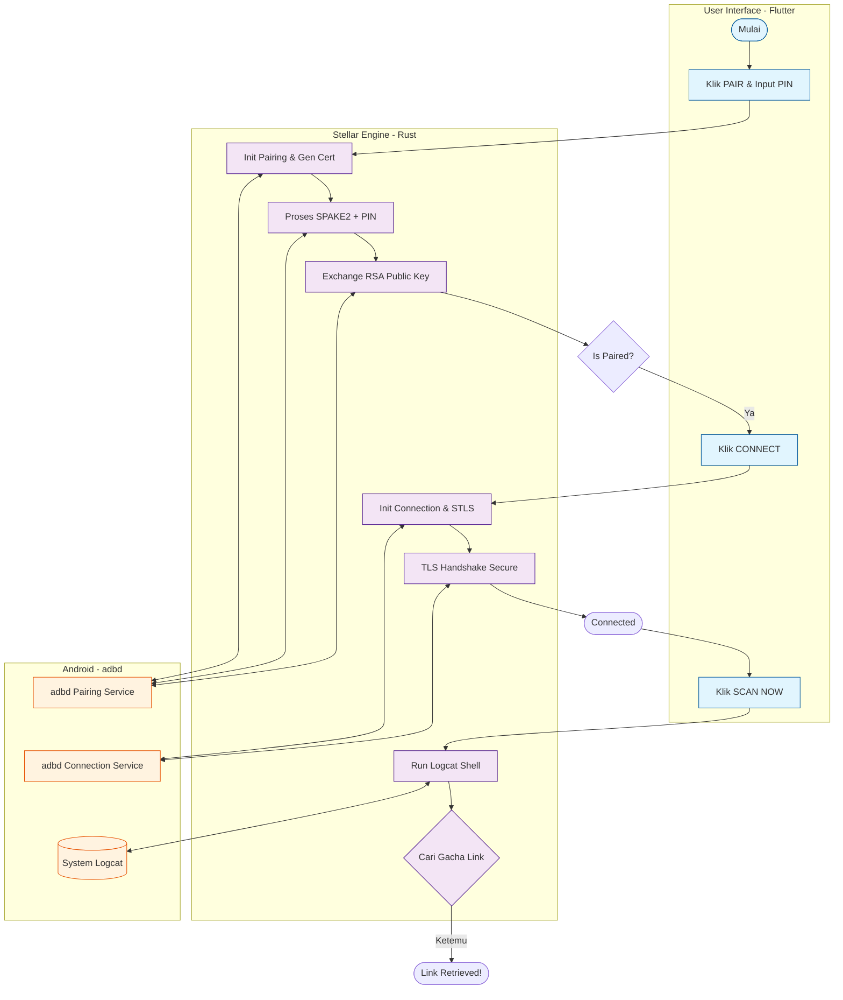

# Alur Kerja Stellar (Pairing -> Connect -> Scan)

Diagram ini menjelaskan bagaimana Stellar berkomunikasi dengan sistem Android menggunakan protokol ADB Wireless Debugging melalui jembatan Flutter & Rust.

## Detail Teknis

### 1. Pairing (Self-Pairing)
Stellar menggunakan teknik *self-pairing* di mana aplikasi bertindak sebagai klien ADB untuk dirinya sendiri.
- **mDNS:** Menemukan port pairing (`_adb-tls-pairing._tcp`).
- **SPAKE2:** Protokol pertukaran kunci aman yang menggabungkan PIN dan **EKM (Exported Keying Material)**.
- **Certificates:** Stellar men-generate sertifikat RSA self-signed (`adb_cert.pem`) yang akan didaftarkan ke sistem Android.

### 2. Connection
Setelah pairing sukses, Stellar membangun koneksi aman setiap kali diperlukan.
- **STLS Negotiation:** Upgrade koneksi TCP standar ke TLS secara aman sesuai protokol ADB modern.
- **Session Persistence:** Sesi TLS disimpan dalam `ACTIVE_SESSION` di memori Rust untuk menjalankan perintah shell.

### 3. Scanning
Proses pengambilan link dilakukan dengan memantau log sistem.
- **Logcat Stream:** Membaca log sistem Android secara real-time melalui enkripsi TLS.
- **Grep Filter:** Rust melakukan filtering otomatis untuk mencari pola URL gacha HoYoverse yang mengandung `authkey`.
